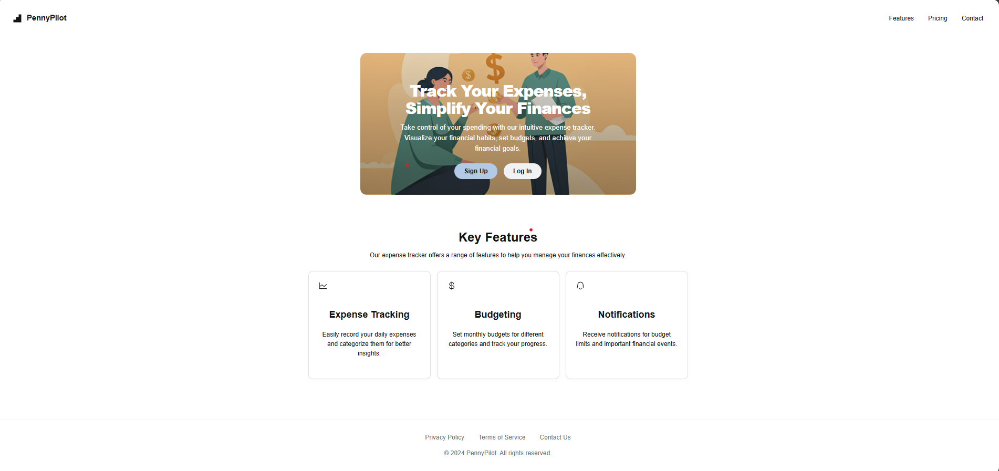

# PennyPilot Expense Tracker

A modern, full-stack expense tracker with authentication, analytics, and a clean UI.

**Frontend:** React (Vite) — hosted on Vercel  
**Backend:** Express + MongoDB — hosted on Render

---

## Features
- User authentication (JWT, bcrypt)
- Add, edit, delete, and view expenses
- Dashboard with charts and analytics (Recharts)
- Responsive, modern UI with CSS Modules
- Gender-based avatar
- Protected routes for all app pages
- INR currency support
- Settings page for user profile

---


## App Screenshots

### 1. Landing Page

*Modern, welcoming landing page for your expense tracker.*

### 2. Login / Signup

*Secure authentication with gender-based avatar selection.*

### 3. Dashboard

*Visual overview of your spending with charts and analytics.*

### 4. Expenses

*View, search, and manage all your expenses in one place.*

### 5. Add Expense

*Quickly add new expenses with category, amount, and date.*

### 6. Settings & Logout

*Update your profile, change settings, and log out securely.*


## Getting Started

### 1. Clone the repo
```sh
git clone https://github.com/yourusername/pennypilot-expense-tracker.git
```

### 2. Setup Environment Variables

#### Frontend (`frontend/.env`)
```
VITE_API_URL=https://your-backend-render-url.onrender.com
```

#### Backend (`backend/.env`)
```
MONGODB_URI=your-mongodb-atlas-uri
JWT_SECRET=your-jwt-secret
CLIENT_URL=https://your-frontend-vercel-url.vercel.app
PORT=8080
```

### 3. Install Dependencies

#### Frontend
```sh
cd frontend
npm install
```

#### Backend
```sh
cd backend
npm install
```

### 4. Run Locally

**Frontend:**
```sh
npm run dev
```

**Backend:**
```sh
npm start
```

---

## Deployment
- **Frontend:** Deploy `/frontend` to Vercel. Set `VITE_API_URL` in Vercel project settings.
- **Backend:** Deploy `/backend` to Render. Set all backend `.env` variables in Render dashboard.

---

## CORS Setup
- Backend uses `CLIENT_URL` from `.env` for CORS.
- Frontend uses `VITE_API_URL` for all API calls.

---

## Future Improvements
- **Notifications:** Get alerts for budget limits or new expenses.
- **Chatbot:** Integrated AI assistant for financial advice.
- **Recurring Expenses:** Support for subscriptions and auto-payments.
- **Advanced Analytics:** More charts, trends, and export options.
- **Dark Mode:** Theme toggle for user preference.
- **Multi-user/Family Accounts:** Share expenses with others.
- **PWA Support:** Installable and offline-capable.

---

## License
MIT

---

**Made with ❤️ for personal finance!**
